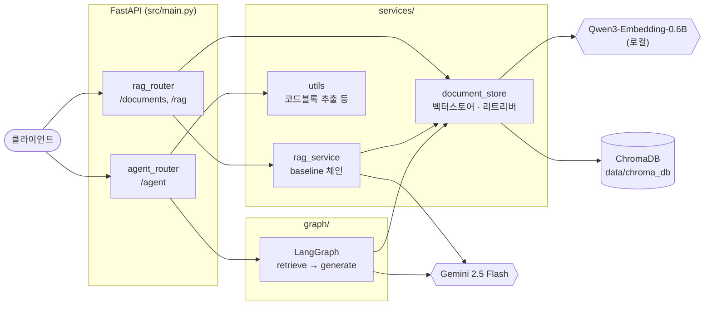
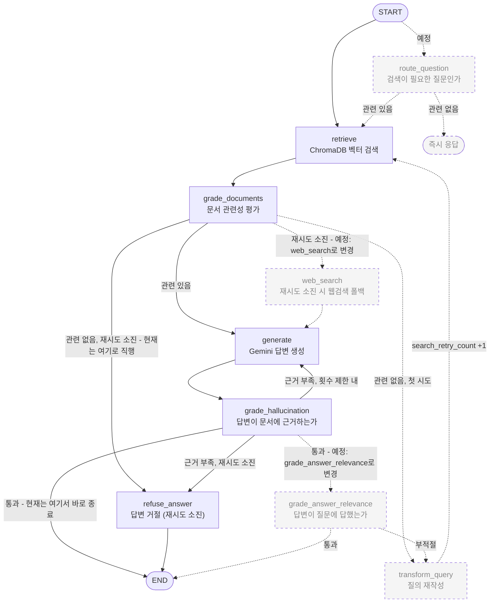
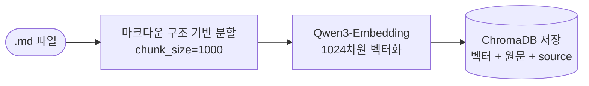
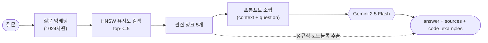

# langgraph-agent

> LangGraph 기반 RAG 에이전트 — 단순 RAG 체인(baseline)과, 검색·생성 품질을 스스로 점검하고 보정하는
> **Corrective RAG(CRAG)** 그래프를 나란히 구현하며 비교하는 개인 포트폴리오 프로젝트

현재는 **FastAPI 공식 문서(한국어 튜토리얼)** 를 예시 데이터로 사용하지만, 이는 임시 데이터일 뿐이며
목표는 특정 문서 도메인에 종속되지 않는 **범용 LangGraph 패턴**을 구현하는 것입니다.

---

## 목차

- [핵심 아이디어](#핵심-아이디어)
- [아키텍처](#아키텍처)
  - [요청 처리 흐름](#요청-처리-흐름)
  - [LangGraph 그래프 구조](#langgraph-그래프-구조)
  - [RAG 데이터 흐름](#rag-데이터-흐름)
- [기술 스택](#기술-스택)
- [프로젝트 구조](#프로젝트-구조)
- [설치 및 실행](#설치-및-실행)
- [API 레퍼런스](#api-레퍼런스)
- [설계 결정](#설계-결정)
- [로드맵](#로드맵)

---

## 핵심 아이디어

이 프로젝트는 **같은 질문에 답하는 두 가지 방식을 동시에 제공**합니다.

| 엔드포인트 | 방식 | 목적 |
|-----------|------|------|
| `POST /api/rag` | 단순 검색 → 생성 체인 | 기준선(baseline) — 보정 로직 없음 |
| `POST /api/agent` | LangGraph 기반 Corrective RAG | 검색·생성 품질을 스스로 점검·보정 |

두 방식을 나란히 두는 이유는, 나중에 **RAGAS / LangSmith 평가로 "CRAG 도입 전후"를 정량 비교**하기 위해서입니다.
그래프가 완성되면 baseline은 비교 기준으로서의 역할을 마치고 제거됩니다.

---

## 아키텍처

### 요청 처리 흐름



### LangGraph 그래프 구조

**1~2단계(`retrieve → generate → grade_hallucination`)와 3단계 판단 노드(`grade_documents`)까지 구현 완료**,
`transform_query`(질의 재작성)만 남았습니다. 아래 다이어그램에서 실선은 구현 완료, 점선은 구현 예정입니다.



**핵심 설계 포인트 1 — 웹검색보다 로컬 재검색이 먼저**: `grade_documents`가 실패하면 **바로 웹검색으로 가지 않고,
먼저 질문을 재작성해서 같은 로컬 ChromaDB를 재검색**합니다. 검색 실패의 대부분은 "문서에 내용이 없어서"가 아니라
"질의 표현이 검색에 안 맞아서"이기 때문에, 비용이 드는 웹검색은 로컬 재검색까지 실패했을 때만 씁니다.

**핵심 설계 포인트 2 — 재시도 카운터를 루프별로 분리**: `grade_documents`(문서 재검색)와 `grade_hallucination`
(답변 재생성)은 서로 다른 시점에 도는 별개의 루프라, 재시도 횟수도 `search_retry_count` / `hallucination_retry_count`로
**따로 관리**합니다. 하나의 카운터를 공유하면, 한쪽 루프가 이미 써버린 횟수 때문에 다른 쪽 루프가 재시도도 못 해보고
조기 종료되는 버그가 생길 수 있습니다.

**핵심 설계 포인트 3 — 실패해도 그냥 끝내지 않고 명시적으로 답변 거절**: 재시도를 다 써도 근거를 못 찾으면,
`generation`을 조용히 그대로 반환하는 게 아니라 `refuse_answer` 노드를 거쳐 **"답변할 수 없다"는 사실을 명확히
알리는 응답**으로 대체합니다. 이 노드를 판단 노드(`grade_documents`, `grade_hallucination`)와 분리해둔 이유는,
나중에 `grade_answer_relevance` 등 다른 판단 노드가 실패했을 때도 **같은 노드를 재사용**하기 위해서입니다.

**그래프 상태(`GraphState`)** — 노드 간에 오가는 데이터:

```python
class GraphState(TypedDict):
    question: str                    # 원본 질문 (재작성해도 값이 안 바뀜)
    query: str                       # 검색용 질의 (transform_query가 갱신)
    documents: list[Document]        # retrieve가 채움
    generation: str                  # generate가 채움
    grounded: bool                   # grade_hallucination의 판단 결과
    relevant: bool                   # grade_documents의 판단 결과
    hallucination_retry_count: int   # 답변 재생성 재시도 횟수
    search_retry_count: int          # 문서 재검색 재시도 횟수
```

### RAG 데이터 흐름

**① 문서 등록 (`POST /api/documents`)**



**② 질의 응답 (`POST /api/agent`)**



---

## 기술 스택

| 분류 | 기술 | 선택 이유 |
|------|------|----------|
| 언어 | Python 3.13 | — |
| 프레임워크 | FastAPI | 비동기 지원, 자동 Swagger 문서화 |
| 오케스트레이션 | LangChain · LangGraph | 조건 분기·재시도 루프가 있는 워크플로우를 상태 그래프로 표현 |
| LLM | Google Gemini 2.5 Flash | instruction-following 우수, 무료 티어 제공 |
| 임베딩 | Qwen3-Embedding-0.6B (로컬) | `max_position_embeddings=32768` — 긴 청크도 잘림 없이 임베딩 |
| 벡터 DB | ChromaDB (로컬 파일) | 별도 서버 없이 파일 기반으로 영속화 |
| 모니터링 | LangSmith | 그래프 실행 과정 자동 트레이싱 |
| 패키지 관리 | uv | 빠른 의존성 해석, `pyproject.toml` + `uv.lock` |

> **임베딩 모델 교체 이력**: 초기에는 `jhgan/ko-sroberta-multitask`를 사용했으나, 이 모델의 `max_seq_length`가
> **128 토큰**(한국어 기준 약 230자)에 불과해 1000자 청크의 약 77%가 임베딩 단계에서 잘려 나갔습니다.
> 검색 정확도에 직접적인 영향을 주는 문제라 32K 토큰까지 처리 가능한 Qwen3-Embedding-0.6B로 교체했습니다.

---

## 프로젝트 구조

```
langgraph-agent/
├── src/
│   ├── main.py                  # FastAPI 앱 진입점, 라우터 등록
│   │
│   ├── router/                  # HTTP 엔드포인트 정의
│   │   ├── rag_router.py        #   /documents, /rag  (baseline)
│   │   └── agent_router.py      #   /agent            (LangGraph)
│   │
│   ├── schemas/                 # 요청/응답 Pydantic 모델
│   │   ├── rag_schema.py        #   RAGRequest, RAGResponse
│   │   └── agent_schema.py      #   AgentRequest, AgentResponse
│   │
│   ├── core/                    # 앱 전역 설정·초기화
│   │   ├── config.py            #   pydantic-settings 기반 환경변수
│   │   └── llm.py               #   Gemini · 임베딩 모델 인스턴스
│   │
│   ├── graph/                   # LangGraph "조립/실행"만 담당
│   │   ├── state.py             #   GraphState (TypedDict)
│   │   ├── nodes/               #   노드 함수 (관심사별로 분리)
│   │   │   ├── retrieval.py     #     retrieve
│   │   │   ├── generation.py    #     generate, refuse_answer
│   │   │   └── grading.py       #     grade_hallucination, grade_documents, 라우팅 함수
│   │   └── graph.py             #   StateGraph 조립 + compile
│   │
│   ├── services/                # 재사용 가능한 "부품"
│   │   ├── document_store.py    #   벡터스토어·리트리버·문서 등록
│   │   ├── prompts.py           #   yaml → ChatPromptTemplate 로딩
│   │   ├── utils.py             #   format_docs, extract_code_blocks
│   │   └── rag_service.py       #   query_rag() — baseline 전용
│   │
│   └── prompts/
│       └── rag.yaml             # RAG 프롬프트 템플릿
│
└── data/
    └── chroma_db/               # ChromaDB 영속 저장소 (git 제외)
```

**모듈 구성 원칙**

- `services/` — 누가 쓰든 상관없는 **재사용 부품**을 모아둠
- `graph/` — 노드를 어떤 **순서/조건**으로 실행할지(엣지)만 담당하고, 부품은 `services/`에서 가져다 씀
- `rag_service.py`는 의도적으로 `query_rag()` 하나만 남겨둠 → baseline 비교가 끝나면
  `rag_router.py` · `rag_schema.py`와 함께 **파일째로 삭제**해도 나머지 코드는 전혀 영향받지 않도록 설계

---

## 설치 및 실행

### 1. 패키지 설치

```bash
uv sync
```

### 2. 환경변수 설정

프로젝트 루트에 `.env` 파일을 생성합니다.

```env
# LangSmith
LANGSMITH_TRACING=true
LANGSMITH_ENDPOINT=https://api.smith.langchain.com
LANGSMITH_API_KEY=your_langsmith_api_key
LANGSMITH_PROJECT=langgraph-agent

# Google Gemini
GOOGLE_API_KEY=your_google_api_key
```

### 3. 서버 실행

```bash
uv run uvicorn src.main:app --reload
```

- Swagger UI: `http://localhost:8000/docs`

> ChromaDB 파일 쓰기가 `--reload`의 감시 대상에 걸려 서버가 반복 재시작될 수 있습니다.
> 필요 시 감시 대상에서 제외하세요:
> ```bash
> uv run uvicorn src.main:app --reload --reload-exclude "data/*" --reload-exclude ".git/*"
> ```

### 4. 예시 문서 적재 (선택)

```bash
# FastAPI 공식 문서(한국어 튜토리얼) 클론
git clone --depth 1 https://github.com/fastapi/fastapi /tmp/fastapi-docs

# 튜토리얼 마크다운 일괄 업로드
for f in /tmp/fastapi-docs/docs/ko/docs/tutorial/*.md; do
  curl -X POST "http://localhost:8000/api/documents" -F "file=@$f"
  echo ""
done
```

---

## API 레퍼런스

### `GET /`

헬스 체크.

```json
{ "status": "online", "message": "langgraph-agent server is running" }
```

### `POST /api/documents`

텍스트/마크다운 파일을 업로드해 RAG 검색 대상으로 등록합니다. 응답의 `chunks`는 **DB 전체 누적 청크 수**입니다.

```json
// Response
{ "message": "'path-params.md' 문서가 등록되었습니다.", "chunks": 210 }
```

### `POST /api/rag` — Baseline

단순 검색 → 생성 체인. 보정 로직이 없습니다.

```json
// Request
{ "question": "경로 매개변수 타입을 어떻게 지정해?" }

// Response
{
  "question": "경로 매개변수 타입을 어떻게 지정해?",
  "answer": "타입 힌트를 사용해서 지정합니다...",
  "sources": ["path-params.md"]
}
```

### `POST /api/agent` — Corrective RAG

LangGraph 기반. baseline 응답에 더해, 검색된 문서에서 추출한 **코드 예제(`code_examples`)** 를 함께 반환합니다.

```json
// Request
{ "question": "경로 매개변수 타입을 어떻게 지정해?" }

// Response
{
  "question": "경로 매개변수 타입을 어떻게 지정해?",
  "answer": "타입 힌트를 사용해서 지정합니다...",
  "sources": ["path-params.md"],
  "code_examples": ["def read_item(item_id: int):\n    return item_id"]
}
```

---

## 설계 결정

<details>
<summary><b>왜 baseline과 agent를 둘 다 유지하는가</b></summary>

그래프가 아직 1단계라 현재는 두 응답이 거의 동일합니다. 하지만 baseline을 남겨둬야
CRAG 노드가 추가된 뒤 **RAGAS(정확도·충실도) / LangSmith Dataset 평가로 개선 효과를 정량 비교**할 수 있습니다.
"유행이라 LangGraph를 썼다"가 아니라 **분기·재시도 루프가 필요해지는 시점에 도입했다**는 근거를 만들기 위한 구조입니다.
</details>

<details>
<summary><b>왜 마크다운 구조 기반으로 청크를 나누는가</b></summary>

일반적인 글자수 기준 분할(`RecursiveCharacterTextSplitter`)은 코드 블록을 중간에서 잘라버립니다.
`Language.MARKDOWN` 분할기는 코드 펜스(` ``` `)·헤더를 우선 경계로 삼아, 코드가 잘리지 않도록 자릅니다.
그 대가로 청크 개수는 늘어나지만(설명과 코드가 서로 다른 청크로 분리됨), 코드 온전성을 우선했습니다.
</details>

<details>
<summary><b>code_examples를 LLM 생성이 아니라 정규식 추출로 만드는 이유</b></summary>

코드의 정확성은 중요합니다. LLM에게 "코드를 그대로 인용하라"고 지시해도 생성 과정에서 변수명·들여쓰기가
바뀔 수 있습니다. 그래서 답변(`answer`)은 LLM이 자연어로 설명하되, 코드(`code_examples`)는
**검색된 원문에서 정규식으로 그대로 추출**해 정확성을 보장합니다.
</details>

<details>
<summary><b>FastAPI 문서의 한계 — 아직 코드가 잘 안 나오는 이유</b></summary>

FastAPI 원본 마크다운은 실제 파이썬 코드를 `{* ../../docs_src/....py hl[6:7] *}` 형식의
**include 매크로**로 참조만 합니다(실제 코드는 `docs_src/` 폴더의 별도 파일). 웹사이트 빌드 시 이 자리에
코드가 채워지므로, 클론한 마크다운 자체에는 코드가 거의 없습니다. 이 매크로를 해석해 실제 코드를 끼워넣는
**전처리 노드**가 필요하며, 현재 미구현 상태입니다.
</details>

---

## 로드맵

- [x] `retrieve → generate` 그래프 (1단계)
- [x] `grade_hallucination` — 답변 근거 여부 체크, 실패 시 재생성 (2단계)
- [x] `grade_documents` — 문서 관련성 평가 (3단계, 판단 노드까지 완료)
- [ ] `transform_query` — 관련 없으면 질의 재작성 후 로컬 재검색 (3단계, 진행 중)
- [ ] `route_question` · `web_search` · `grade_answer_relevance` — 질문 라우팅, 웹검색 폴백, 답변 적절성 평가 (4단계)
- [ ] `{* *}` include 매크로 해석 전처리 노드 (실제 코드 예제 적재)
- [ ] RAGAS / LangSmith Dataset 기반 baseline 대비 성능 평가
- [ ] baseline(`rag_router` · `rag_service` · `rag_schema`) 제거
