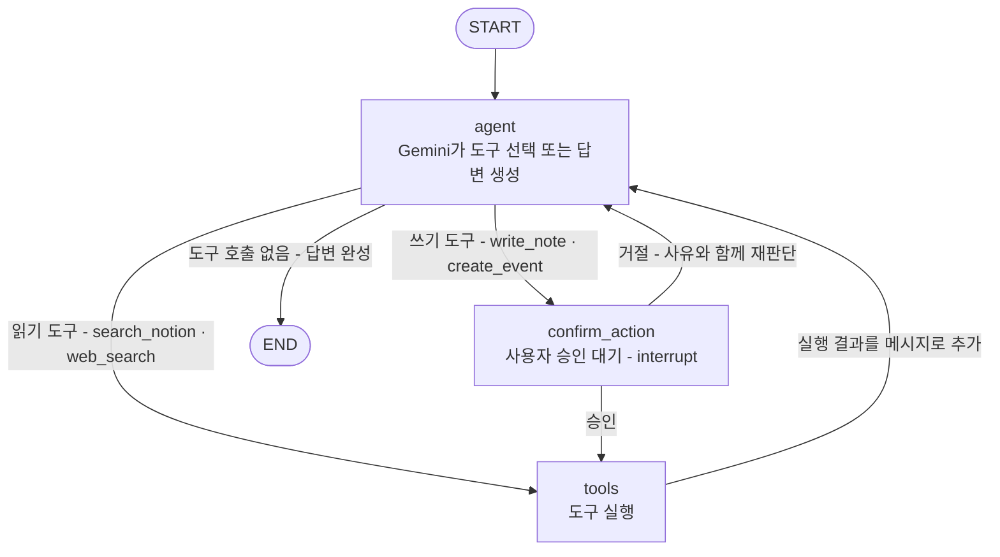
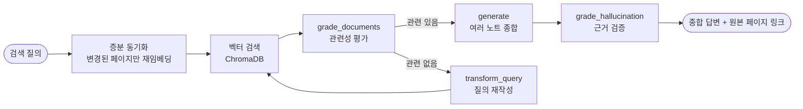
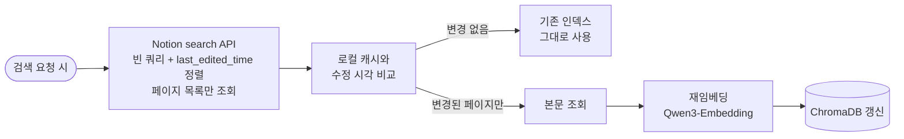

# notion-assistant (langgraph-agent 개편)

> LangGraph 기반 **Notion 개인 비서 에이전트** — 내 노션에서 정보를 찾아 종합해 답하고,
> 새 내용을 적절한 위치에 작성하고, 자연어로 일정을 등록해주는 tool-calling 에이전트

기존 CRAG(Corrective RAG) 프로젝트에서 개편한 프로젝트입니다. CRAG에서 구현한 판단 노드
(`grade_documents`, `transform_query`, `grade_hallucination`)는 버리지 않고
**노션 검색 도구의 내부 파이프라인으로 재사용**합니다.

---

## 목차

- [핵심 아이디어](#핵심-아이디어)
- [사용 시나리오](#사용-시나리오)
- [아키텍처](#아키텍처)
  - [LangGraph 그래프 구조 — ReAct 루프](#langgraph-그래프-구조--react-루프)
  - [search_notion 내부 파이프라인](#search_notion-내부-파이프라인)
  - [노션 증분 동기화](#노션-증분-동기화)
- [도구 목록](#도구-목록)
- [기술 스택](#기술-스택)
- [프로젝트 구조 (목표)](#프로젝트-구조-목표)
- [설치 및 실행](#설치-및-실행)
- [API 설계 초안](#api-설계-초안)
- [설계 결정](#설계-결정)
- [로드맵](#로드맵)

---

## 핵심 아이디어

단순한 "Notion API 래퍼"가 아니라, **판단이 필요한 지점을 에이전트가 대신하는 것**이 목적입니다.

| 사람이 직접 하면 | 에이전트가 하면 |
|---|---|
| 검색창에 키워드를 넣고, 여러 페이지를 열어 읽고, 머릿속으로 종합 | 흩어진 노트를 찾아 **근거 검증을 거친 하나의 답변**으로 종합 |
| 어느 페이지에 적을지 고민하고, 중복인지 기존 노트를 뒤져봄 | **관련 노트를 먼저 검색해서 "이어붙일지 / 새로 만들지" 판단** 후 확인을 구함 |
| 캘린더를 열고 날짜·시간을 클릭해 입력 | "다음주 화요일 3시 팀 미팅"이라는 **자연어를 해석**해 일정 항목 생성 |

그래프 관점의 핵심 변화: 이전 CRAG는 분기 경우의 수를 사람이 미리 전부 설계한 **고정 그래프**였다면,
이번에는 **LLM이 매 턴 어떤 도구를 쓸지 스스로 결정하는 ReAct 루프**입니다.
요청마다 실제로 다른 경로(검색 / 작성 / 일정 / 그냥 대화)를 타기 때문에, 그래프 분기가 형식적이지 않고
실질적으로 동작합니다.

---

## 사용 시나리오

**A. 검색·질의응답** (도구: `search_notion`)

> "저번주에 진행한 프로젝트A 정리한 문서에서 어떤 내용 협의했는지 확인할 수 있나?"

관련 노트 검색 → 관련성 평가 → (실패 시 질의 재작성 후 재검색) → 여러 노트 종합 답변 → 근거 검증 →
"[프로젝트A 회의록] 페이지에 이렇게 정리되어 있어요: ..." + 원본 페이지 링크

**B. 노트 작성 — 신규 또는 병합** (도구: `write_note` + 승인)

> "오늘 인터뷰 스터디에서 STAR 기법 배웠어, 나중에 참고하게 적어줘"

관련 기존 노트 검색 → 없으면 "새 페이지로 만들까요?", 있으면 "[인터뷰 준비] 페이지에 이어붙일까요?" →
**사용자 승인 후** 실행

**C. 일정 등록** (도구: `create_event` + 승인)

> "다음주 화요일 3시에 팀 미팅 잡아줘"

자연어에서 날짜·시간·제목 해석 → "7/21(화) 15:00 '팀 미팅' 일정을 등록할까요?" → **승인 후**
캘린더 뷰로 사용 중인 노션 데이터베이스에 날짜 속성을 채운 페이지 생성

**D. 일반 대화** (도구 없음)

> "LangGraph에서 interrupt가 뭐야?"

검색·작성이 필요 없는 질문은 도구 호출 없이 바로 답변하고 종료 — LLM이 "도구가 필요 없다"고 판단하는
것 자체가 하나의 경로

---

## 아키텍처

### LangGraph 그래프 구조 — ReAct 루프



**핵심 설계 포인트 1 — 조건부 엣지는 도구 개수만큼 늘어나지 않음**: "어떤 도구를 쓸지"는 그래프 엣지가
아니라 `agent` 노드 안에서 LLM(`bind_tools`)이 이미 결정합니다. 그래프가 판단하는 것은
"도구 호출이 있는가 / 그것이 쓰기 도구인가"라는 단순한 분기뿐이라, 도구가 늘어나도 그래프 구조는
그대로입니다.

**핵심 설계 포인트 2 — 쓰기만 승인을 받음**: 검색(읽기)은 실패해도 되돌릴 것이 없지만, 작성(쓰기)은
잘못되면 기존 노트를 오염시킵니다. 그래서 `write_note`·`create_event`만 `confirm_action`
(LangGraph `interrupt()` 기반 human-in-the-loop)을 거치고, 읽기 도구는 바로 실행합니다.

**핵심 설계 포인트 3 — 상태는 MessagesState 기반**: 이전 CRAG의 필드형 상태
(`question`/`documents`/`generation`)는 1회성 파이프라인용이었습니다. 비서는 여러 턴의 대화와
도구 호출 이력을 이어가야 하므로, 메시지 리스트를 누적하는 `MessagesState` 기반으로 전환합니다.

### search_notion 내부 파이프라인

이전 CRAG에서 구현한 판단 노드들이 여기서 그대로 재사용됩니다. 개인 노트는 LLM이 사전학습에서
전혀 본 적 없는 내용이라, **근거 검증 없이는 신뢰할 수 있는 답이 성립하지 않습니다** —
공개 문서 RAG에서는 "있으면 좋은" 검증이었지만, 개인 노트에서는 필수입니다.



### 노션 증분 동기화

Notion API의 `search` 엔드포인트는 **페이지 제목만 검색**하며 본문은 검색 대상이 아닙니다
(공식 문서: "titles that include the query param" — 커뮤니티에서도 잘 알려진 제약).
따라서 본문 검색은 로컬 벡터 인덱스로 직접 해결하되, "스냅샷이 오래되는" 문제는
**매 검색 요청 시점에 변경분만 확인·재임베딩**하는 방식으로 해결합니다.



- 태그·데이터베이스 구조 등 **사용자에게 아무 정리 규칙도 강제하지 않음** — 자유롭게 적은 페이지도 검색 가능
- 전체 재임베딩이 아니라 **변경분만** 처리하므로 요청당 오버헤드가 작음
- Notion API는 무료이며 요청당 과금이 없음 (rate limit: 초당 평균 3건)

---

## 도구 목록

| 도구 | 역할 | 성격 | 승인(HITL) |
|------|------|------|:---:|
| `search_notion` | 내 노션 페이지를 검색해 근거 검증을 거친 종합 답변 생성 | 읽기 | ✕ |
| `web_search` | 노션에 없는 일반 지식·최신 정보 검색 | 읽기 | ✕ |
| `write_note` | 관련 기존 페이지를 먼저 검색해 "병합 / 신규" 판단 후 작성 | 쓰기 | ✓ |
| `create_event` | 자연어 일정을 해석해 캘린더 뷰 데이터베이스에 항목 생성 | 쓰기 | ✓ |

---

## 기술 스택

| 분류 | 기술 | 선택 이유 |
|------|------|----------|
| 언어 | Python 3.13 | — |
| 프레임워크 | FastAPI | 비동기 지원, 자동 Swagger 문서화 |
| 오케스트레이션 | LangChain · LangGraph | ReAct 루프 + human-in-the-loop(`interrupt`)를 상태 그래프로 표현 |
| LLM | Google Gemini 2.5 Flash | tool-calling 지원, instruction-following 우수, 무료 티어 제공 |
| 임베딩 | Qwen3-Embedding-0.6B (로컬) | 32K 토큰까지 처리 — 긴 노트도 잘림 없이 임베딩, 호출 비용 없음 |
| 벡터 DB | ChromaDB (로컬 파일) | 별도 서버 없이 파일 기반 영속화, 증분 갱신 용이 |
| 외부 연동 | Notion API (`notion-client`) | 페이지 목록·본문 조회, 페이지 생성 — 무료, rate limit 3 req/s |
| 웹검색 | Tavily (예정) | RAG용으로 설계된 검색 API, 무료 티어 제공 |
| 모니터링 | LangSmith | 도구 선택·그래프 실행 과정 자동 트레이싱 |
| 패키지 관리 | uv | 빠른 의존성 해석, `pyproject.toml` + `uv.lock` |

---

## 프로젝트 구조 (목표)

> 아직 개편 전이며, 아래는 목표 구조입니다. 현재 코드는 이전 CRAG 프로젝트 구조입니다
> (이전 프로젝트 문서는 git 히스토리의 README.md 참고).

```
langgraph-agent/
├── src/
│   ├── main.py                  # FastAPI 앱 진입점
│   │
│   ├── router/
│   │   └── agent_router.py      #   /agent — 비서 대화 엔드포인트
│   │
│   ├── schemas/
│   │   └── agent_schema.py      #   요청/응답 모델 (thread_id 포함)
│   │
│   ├── core/
│   │   ├── config.py            #   pydantic-settings 기반 환경변수
│   │   └── llm.py               #   Gemini · 임베딩 모델 인스턴스
│   │
│   ├── graph/                   # LangGraph "조립/실행"만 담당
│   │   ├── state.py             #   MessagesState 기반 상태
│   │   ├── nodes/
│   │   │   ├── agent.py         #     agent — bind_tools된 LLM 호출
│   │   │   ├── confirm.py       #     confirm_action — interrupt 기반 승인
│   │   │   └── ...              #     라우팅 함수 등
│   │   └── graph.py             #   StateGraph 조립 + checkpointer + compile
│   │
│   ├── tools/                   # 에이전트 도구 정의 (@tool)
│   │   ├── search_notion.py     #   내부에서 CRAG 파이프라인 재사용
│   │   ├── web_search.py
│   │   ├── write_note.py
│   │   └── create_event.py
│   │
│   ├── services/                # 재사용 가능한 "부품"
│   │   ├── notion_client.py     #   Notion API 래핑 (목록·본문·생성)
│   │   ├── notion_index.py      #   증분 동기화 벡터 인덱스
│   │   ├── prompts.py           #   yaml → ChatPromptTemplate 로딩
│   │   └── utils.py
│   │
│   └── prompts/                 # 프롬프트 템플릿 (yaml)
│
└── data/
    └── chroma_db/               # 노션 페이지 벡터 인덱스 (git 제외)
```

**모듈 구성 원칙** (이전 프로젝트에서 유지)

- `services/` — 누가 쓰든 상관없는 **재사용 부품**
- `graph/` — 노드를 어떤 **순서/조건**으로 실행할지만 담당
- `tools/` — `services/`의 부품을 조합해 에이전트에게 노출하는 **도구 인터페이스**

---

## 설치 및 실행

### 1. 패키지 설치

```bash
uv sync
```

### 2. 환경변수 설정

프로젝트 루트에 `.env` 파일을 생성합니다.

```env
# LangSmith
LANGSMITH_TRACING=true
LANGSMITH_ENDPOINT=https://api.smith.langchain.com
LANGSMITH_API_KEY=your_langsmith_api_key
LANGSMITH_PROJECT=notion-assistant

# Google Gemini
GOOGLE_API_KEY=your_google_api_key

# Notion — 내부 통합(internal integration) 토큰
NOTION_API_KEY=your_notion_integration_token

# 일정 등록 대상 데이터베이스 (캘린더 뷰로 사용 중인 DB)
NOTION_CALENDAR_DB_ID=your_database_id
```

> Notion 통합 토큰은 [notion.so/my-integrations](https://www.notion.so/my-integrations)에서 발급하고,
> 검색·작성 대상 페이지에 해당 통합을 **연결(connection 추가)** 해야 API로 접근할 수 있습니다.

### 3. 서버 실행

```bash
uv run uvicorn src.main:app --reload --reload-exclude "data/*" --reload-exclude ".git/*"
```

- Swagger UI: `http://localhost:8000/docs`

---

## API 설계 초안

> 구현 전 설계 단계의 초안입니다. HITL 승인 흐름 때문에 대화가 `thread_id` 단위로 이어집니다.

### `POST /api/agent`

```json
// Request
{ "message": "다음주 화요일 3시에 팀 미팅 잡아줘", "thread_id": "user-session-1" }

// Response — 쓰기 도구라 승인 대기 (interrupt로 그래프 일시정지)
{
  "status": "pending_confirmation",
  "message": "7/21(화) 15:00 '팀 미팅' 일정을 캘린더에 등록할까요?"
}
```

```json
// Request — 같은 thread_id로 승인 응답
{ "message": "응 등록해줘", "thread_id": "user-session-1" }

// Response — 그래프 재개(resume) 후 실행 완료
{
  "status": "done",
  "message": "등록했어요. 7/21(화) 15:00 '팀 미팅' — 페이지 링크: https://notion.so/..."
}
```

---

## 설계 결정

<details>
<summary><b>왜 Notion AI를 쓰지 않고 직접 만드는가</b></summary>

Notion AI는 유료 구독(Business 플랜 이상)이지만, Notion의 일반 API는 무료입니다.
API 위에 Gemini(무료 티어)와 로컬 임베딩을 조합하면 구독료 없이 같은 목적을 달성할 수 있습니다.
다만 이 프로젝트의 주 목적은 비용 절감보다 **LangGraph 에이전트 패턴(ReAct 루프, HITL, 도구 설계)의
실습·포트폴리오**이며, Notion AI의 대체 상품이 아니라 개인 워크스페이스용 자동화 도구입니다.
(사내 자동화·개인 자동화는 Notion이 Developer Platform으로 공식 권장하는 사용 방식입니다.)
</details>

<details>
<summary><b>왜 고정 분기 그래프가 아니라 ReAct 루프인가</b></summary>

이전 CRAG는 모든 분기(관련성 평가 실패 → 재작성 → 재검색 ...)를 사람이 미리 설계한 고정 그래프였습니다.
문서 QA처럼 흐름이 하나뿐인 태스크에는 맞지만, 비서는 요청 유형(검색/작성/일정/잡담)이 매번 달라서
경우의 수를 미리 나열할 수 없습니다. ReAct 루프는 "어떤 도구를 쓸지"를 LLM의 tool-calling에 맡기고,
그래프는 "도구 호출 여부 / 쓰기 여부"라는 단순한 분기만 담당합니다.
`create_react_agent` 프리빌트를 쓰지 않고 StateGraph로 직접 조립하는 이유는, 쓰기 도구 앞에
**승인 노드(confirm_action)를 끼워 넣어야** 하기 때문입니다 — 프리빌트는 이 지점을 커스텀할 수 없습니다.
</details>

<details>
<summary><b>왜 로컬 벡터 인덱스가 필요한가 — Notion API의 제약</b></summary>

Notion `search` API는 페이지 **제목**만 검색하고 본문은 검색하지 못합니다.
"회의록 0708"이라는 제목의 페이지 본문에만 "프로젝트A" 얘기가 있다면 API 검색으로는 찾을 수 없습니다.
그래서 본문 검색은 로컬 임베딩 인덱스로 직접 구현하되, 스냅샷이 오래되는 문제는
**검색 요청 시점마다 `last_edited_time` 기준으로 변경분만 재임베딩**하는 증분 동기화로 해결합니다.
태그·DB 구조 강제(사용자에게 정리 규칙을 요구하는 방식)도 검토했지만, 사용자 부담을 지우지 않는
증분 인덱스 방식을 택했습니다.
</details>

<details>
<summary><b>왜 write_note는 저장 전에 검색부터 하는가</b></summary>

"기존에 관련 페이지가 있는지"를 LLM 단독 판단에 맡기면 존재하지 않는 페이지를 있다고 착각할 수
있습니다. 검색 오류는 틀린 답을 주는 것에 그치지만, **쓰기 오류는 엉뚱한 페이지를 오염**시킵니다.
그래서 저장 전에 `search_notion`과 같은 검색 경로로 후보를 확보하고, 그 근거 위에서
"이어붙일지 / 새로 만들지"를 판단한 뒤, 최종 실행은 사용자 승인을 거칩니다 —
"검증되지 않은 LLM 단독 판단을 믿지 않는다"는 CRAG의 원칙을 쓰기 경로에 적용한 것입니다.
</details>

<details>
<summary><b>CRAG 판단 노드를 재사용하는 이유 — 개인 노트에서 근거 검증은 필수</b></summary>

공개 문서(FastAPI 등)는 LLM이 사전학습으로 이미 알고 있어 검증 노드가 발동할 일이 드뭅니다.
반면 개인 노트는 LLM이 전혀 모르는 내용이라, 검색된 노트에 실제로 근거가 있는지
(`grade_hallucination`), 검색 결과가 질문과 관련이 있는지(`grade_documents`) 확인하는 과정이
답변 신뢰성의 전제 조건이 됩니다. 같은 노드가 도메인이 바뀌자 "형식적 안전망"에서
"필수 검증"으로 역할이 바뀌는 것이 이 개편의 핵심입니다.
</details>

---

## 로드맵

- [ ] **1단계 — ReAct 뼈대**: `MessagesState` 전환, `agent ⇄ tools` 루프, 도구 유무 분기
- [ ] **2단계 — search_notion**: Notion API 연동(목록·본문 조회), 증분 동기화 인덱스, CRAG 판단 파이프라인 재사용
- [ ] **3단계 — write_note + confirm_action**: `interrupt()` 기반 HITL 승인, 병합/신규 판단
- [ ] **4단계 — create_event**: 자연어 일정 해석, 캘린더 뷰 DB에 항목 생성 (confirm_action 재사용)
- [ ] **5단계 — web_search**: Tavily 연동, 노션에 없는 정보 폴백
- [ ] **6단계 — 정리·평가**: 이전 CRAG 전용 코드(baseline 라우터 등) 제거, LangSmith 기반 도구 선택 정확도 평가
